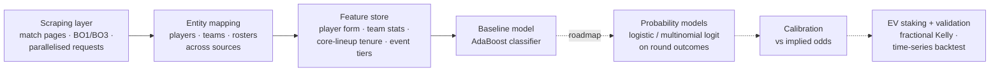

# Esports Alpha Research — CS:GO/CS2 Match Prediction

> **Status: data infrastructure built · baseline model in place · edge validation = the open roadmap.** This is a live personal research project, published at the honest stage it's at.

Can domain expertise plus systematic modelling find positive expected value in esports betting markets? Betting odds are prices: they aggregate the crowd's read of team form, roster changes and event context. The edge — if it exists — lives where that aggregation is wrong. This is the same problem as validating a trading rule, and I treat it the same way.

## Pipeline

## What's built (`notebooks/`)

**01_scraping** — acquisition from public esports statistics pages:
- `bo3_scraper.ipynb` / `bo1_scraper.ipynb` — match results, scores, links, dates, regions by series format
- `match_history_scraper.ipynb` — bulk historical results (300+ pages)
- `parallel_scraping.ipynb` — concurrent scraping with `concurrent.futures`; order-of-magnitude speedup
- `anti_bot_strategies.ipynb` — the war stories: 403 handling, user-agent rotation, Selenium waits vs raw requests

**02_features**:
- `player_stats.ipynb` — per-player, per-map statistics extraction into tidy DataFrames
- `entity_mapping.ipynb` — the unglamorous core: consistent player/team identity across pages and roster changes
- `team_stats.ipynb`, `event_tiers.ipynb` — team-level aggregates and tournament-tier context (a Tier-1 final ≠ a qualifier)

**03_models**:
- `adaboost_baseline.ipynb` — first classifier + the feature roadmap (round history, inter-team tier gaps, core-vs-stand-in performance, core time together, form variance)

## Roadmap (in order)
1. Consolidate scraped tables into a proper database with clean point-in-time keys
2. Logistic regression baseline for match outcome; **multinomial logit over round-score outcomes** (each final score gets a probability, not just win/lose)
3. **Probability calibration** — predicted probabilities vs bookmaker-implied ones; calibration curves and Brier scores (a model can rank well and still lose money)
4. Positive-EV staking with fractional Kelly sizing
5. Validation with the same discipline as my trading system: time-series splits, no leakage, pre-registered thresholds

## Why I might have an edge to find
I managed a top-1% esports team (built game plans from opponent statistics) and have competed at a high level myself. Player form is brutally non-stationary — roster changes, role swaps, LAN vs online — and knowing *which* features plausibly matter is domain knowledge the average model doesn't have.

## Data
No scraped data is committed. Collected for personal research with rate-limited, respectful access; reproduce via the notebooks against the public pages.
