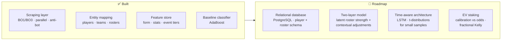

# Esports Alpha Research — CS2 Match Prediction

> **Goal:** predict the total number of rounds played in professional CS2 matchups by modelling relative team strength, then translate that prediction into positive-EV bets against market odds.
>
> **Status:** data infrastructure and baseline model are built. The statistical validation, deeper model architecture, and betting logic are the active roadmap.

Betting odds are prices — they aggregate the crowd's read of team form, roster changes and event context. The edge, if it exists, lives where that aggregation is wrong. This is the same problem shape as validating a trading rule, and I treat it the same way.

## Pipeline

## What's built (`notebooks/`)

**01_scraping** — acquisition from public esports statistics pages:
- `bo3_scraper.ipynb` / `bo1_scraper.ipynb` — match results, scores, links, dates, regions
- `match_history_scraper.ipynb` — bulk historical results (300+ pages)
- `parallel_scraping.ipynb` — concurrent scraping with `concurrent.futures` for order-of-magnitude speedup
- `anti_bot_strategies.ipynb` — 403 handling, user-agent rotation, Selenium vs raw-requests trade-offs

**02_features:**
- `player_stats.ipynb` — per-player, per-map statistics into tidy DataFrames
- `entity_mapping.ipynb` — consistent player/team identity across pages and roster changes
- `team_stats.ipynb`, `event_tiers.ipynb` — team aggregates and tournament-tier context (a Tier-1 final ≠ a qualifier)

**03_models:**
- `adaboost_baseline.ipynb` — first classifier + feature roadmap (round history, tier gaps between teams, core-vs-stand-in performance, core-lineup tenure, form variance)

## Roadmap (in order, what I'm building next)
1. **Consolidate into PostgreSQL** with a schema separating individual player form from five-player roster synergy — so a lineup that just played together five weeks can be scored differently from a stable roster
2. **Two-layer model:** first layer estimates latent roster strength from individual skill + synergy; second layer adjusts for competition prestige, LAN vs online, and geographic context — the environmental factors that drive match *volatility* (which is what "total rounds" is really predicting)
3. **Time-aware form modelling:** researching LSTMs to weight recent matches properly, plus t-distributions for the small samples inherent to stable rosters (often <100 matches)
4. **Probability calibration** against bookmaker-implied probabilities — calibration curves, Brier scores (a model can rank teams well and still lose money on badly-calibrated probabilities)
5. **EV staking with fractional Kelly**, validated with the same discipline as my trading system: time-series splits, no leakage, pre-registered thresholds

## Why I might have an edge to find
I managed a top-1% Rainbow Six Siege team and ranked in the top ~1000 EU CS2. Player form is brutally non-stationary — roster changes, role swaps, LAN vs online, event pressure — and knowing *which* features plausibly matter is domain knowledge the average model doesn't have.

## Data
No scraped data is committed. Collected for personal research with rate-limited, respectful access; reproduce via the notebooks against the public pages.
